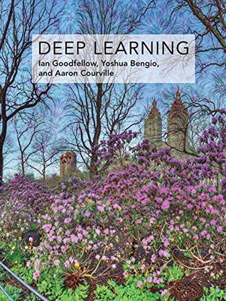
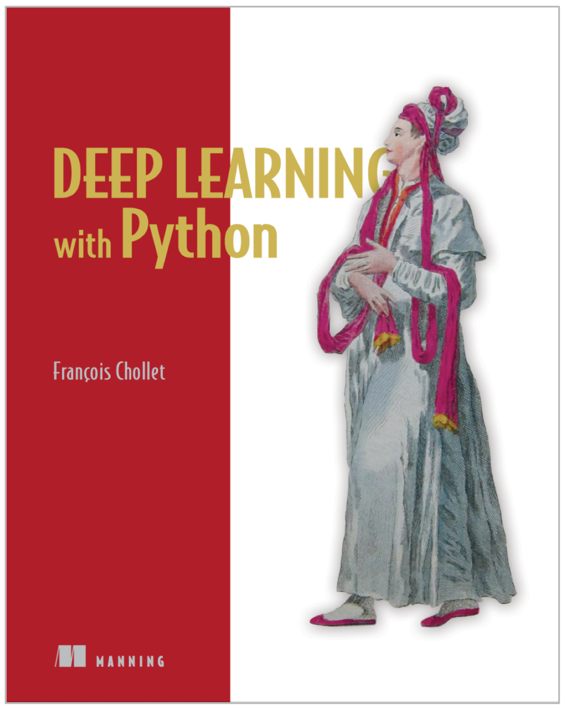
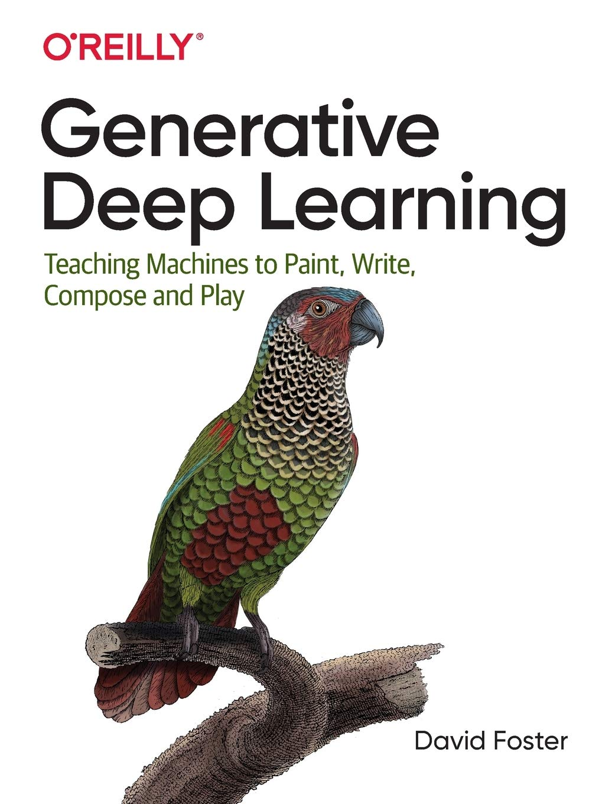
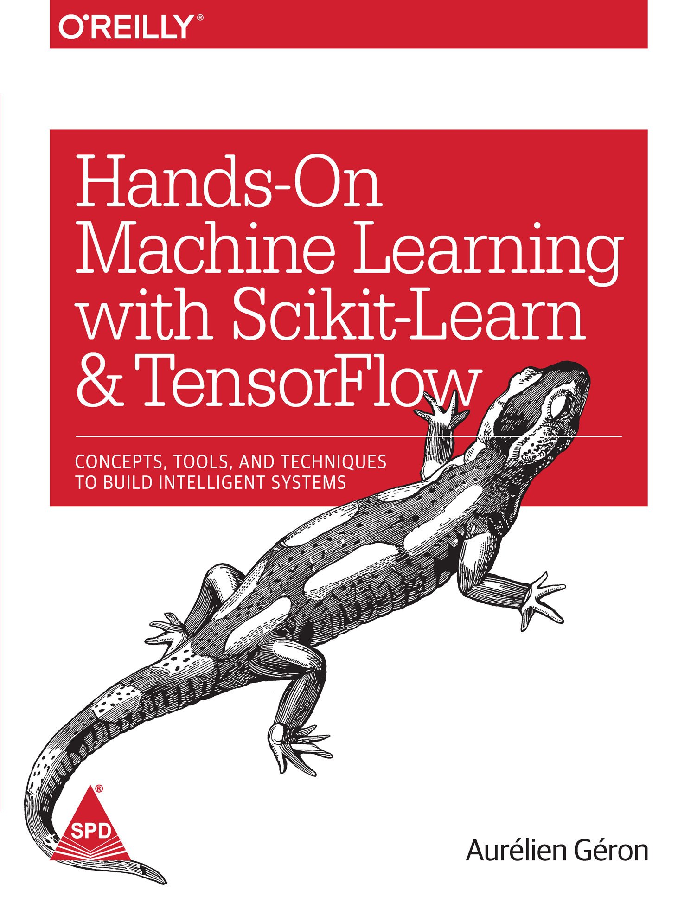

## AI-resources
Important machine learning / deep learning / Image Processing resources.  blogs | courses | articles | tutorials | repositories | books | competition | papers etc. 

---

### Python

- [[programiz] Python Built-in Functions](https://www.programiz.com/python-programming/methods/built-in)

- [[Corey Schafer] Python Programming Beginner Tutorials](https://www.youtube.com/playlist?list=PL-osiE80TeTskrapNbzXhwoFUiLCjGgY7)

- [[Corey Schafer] Python OOP Tutorials - Working with Classes](https://www.youtube.com/playlist?list=PL-osiE80TeTsqhIuOqKhwlXsIBIdSeYtc)
- [[Real Python] Intermediate and Advanced Features](https://www.youtube.com/playlist?list=PLP8GkvaIxJP0VAXF3USi9U4JnpxUvQXHx)

---
### OpenCV
- [[pyimagesearch] How To Build a Kick-Ass Mobile Document Scanner in Just 5 Minutes](https://www.pyimagesearch.com/2014/09/01/build-kick-ass-mobile-document-scanner-just-5-minutes/)

- [[pyimagesearch] Blur detection with OpenCV](https://www.pyimagesearch.com/2015/09/07/blur-detection-with-opencv/)

- [[pyimagesearch] Measuring the size of objects in an image with OpenCV](https://www.pyimagesearch.com/2016/03/28/measuring-size-of-objects-in-an-image-with-opencv/)

- [[py2py] Bokeh Effect in Image using Python](https://py2py.com/bokeh-effect-in-image-using-python/)

- [[pysource] face swapping](https://pysource.com/2019/04/04/face-swapping-opencv-with-python-part-1/)

---
### NumPy

- [[Nicolas P. Rougie] From Python to Numpy](https://www.labri.fr/perso/nrougier/from-python-to-numpy/)

- [[stanford] Python Numpy Tutorial (with Jupyter and Colab)](https://cs231n.github.io/python-numpy-tutorial/)

---
### PyTorch
- [[pytorch] Official Tutorial](https://pytorch.org/tutorials/)

- [[Sung Kim] PyTorchZeroToAll](https://www.youtube.com/playlist?list=PLlMkM4tgfjnJ3I-dbhO9JTw7gNty6o_2m)

- [[deeplizard] Neural Network Programming - Deep Learning with PyTorch](https://www.youtube.com/playlist?list=PLZbbT5o_s2xrfNyHZsM6ufI0iZENK9xgG)

- [[sentdex] Pytorch - Deep learning w/ Python](https://www.youtube.com/playlist?list=PLQVvvaa0QuDdeMyHEYc0gxFpYwHY2Qfdh)

- [[kaggle] Pytorch Tutorial for Deep Learning Lovers](https://www.kaggle.com/kanncaa1/pytorch-tutorial-for-deep-learning-lovers)

- [[SATYA MALLICK] Multi-Label Image Classification with PyTorch](https://www.learnopencv.com/multi-label-image-classification-with-pytorch/)

---
### Books

<table>
  <tr>
     <td>Deep Learning- Ian Goodfellow, Aaron Courville, Yoshua Bengio</td>
     <td>Deep Learning with Python - François Chollet</td>
     <td>Grokking Deep Learning - Andrew W. Trask </td>
  </tr>
  
  <tr>
    <td></td>
    <td></td>
    <td></td>
  </tr>
 </table>

 <table>
  <tr>
     <td>Generative Deep Learning - David Foster</td>
     <td>Machine Learning Yearning - Andrew Ng</td>
     <td>Hands-On Machine Learning with Scikit-Learn, Keras, and TensorFlow - Aurelien Geron </td>
  </tr>
  
  <tr>
    <td></td>
    <td></td>
    <td></td>
  </tr>
 </table>

---

### Papers

- [[arxiv] YOLACT++: Better Real-time Instance Segmentation](https://arxiv.org/abs/1912.06218)

- [[arxiv] UNet++: Redesigning Skip Connections to Exploit Multiscale Features in Image Segmentation](https://arxiv.org/abs/1912.05074)

- [[read] Blurred Image Region Detection and Classification](https://fled.github.io/paper/blur.pdf)

- [[arxiv] Grad-CAM++: Improved Visual Explanations for Deep Convolutional Networks](https://arxiv.org/abs/1710.11063)

---
### Course
- [MIT 6.S191: Introduction to Deep Learning](https://www.youtube.com/playlist?list=PLtBw6njQRU-rwp5__7C0oIVt26ZgjG9NI)
- [Stanford CS231n: Convolutional Neural Networks for Visual Recognition](http://cs231n.stanford.edu/)
- [Coursera: Deep Learning Specialization](https://www.coursera.org/specializations/deep-learning)

- [Udacity: Machine Learning](https://classroom.udacity.com/courses/ud262)

---
### Maths
- [[3Blue1Brown] Essence of linear algebra](https://www.youtube.com/playlist?list=PLZHQObOWTQDPD3MizzM2xVFitgF8hE_ab)

- [[udacity] Intro to statistics](https://classroom.udacity.com/courses/st101)

---

### AI trending news/technolgies
- [Google AI Blog](https://ai.googleblog.com/)
- [ai.stanford.edu](https://ai.stanford.edu/)
- [deepmind blogs](https://deepmind.com/blog)
- [uber-ai-labs](https://eng.uber.com/tag/uber-ai-labs/)
- [microsoft-research-ai](https://www.microsoft.com/en-us/research/lab/microsoft-research-ai/)
- [IBM ai](http://www.research.ibm.com/ai/#)
- [openai blogs](https://openai.com/blog/)
- [facebook AI research](https://research.fb.com/publications/)

- [Berkeley Artificial Intelligence Research (BAIR)](https://bair.berkeley.edu/)
- [MIT Computer Science & Artificial Intelligence Lab](https://www.csail.mit.edu/)
- [Max Planck Institute for Intelligent Systems](https://is.tuebingen.mpg.de/)
- [Oxford Robotics Institute (ORI)](https://ori.ox.ac.uk/)
- [arxiv AI recent papers](https://arxiv.org/list/cs.AI/recent)
- [arxiv sanity](http://www.arxiv-sanity.com/)
- [inFERENCe](https://www.inference.vc/)
- [offconvex](http://www.offconvex.org/)
- [NLP News](http://newsletter.ruder.io/)
- [MIT Technology review](https://www.technologyreview.com/)
- [DeepAI](https://deepai.org/)

---